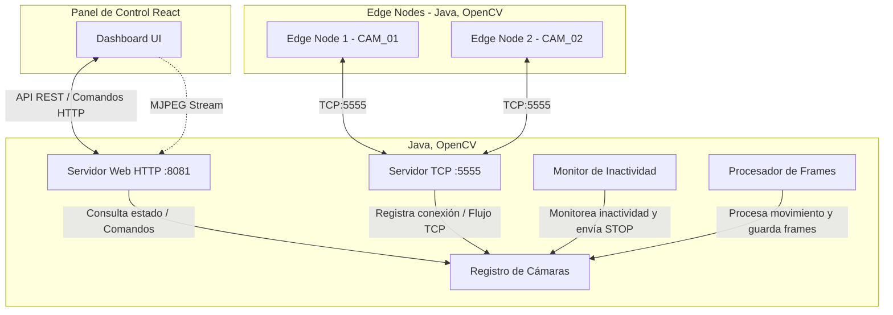
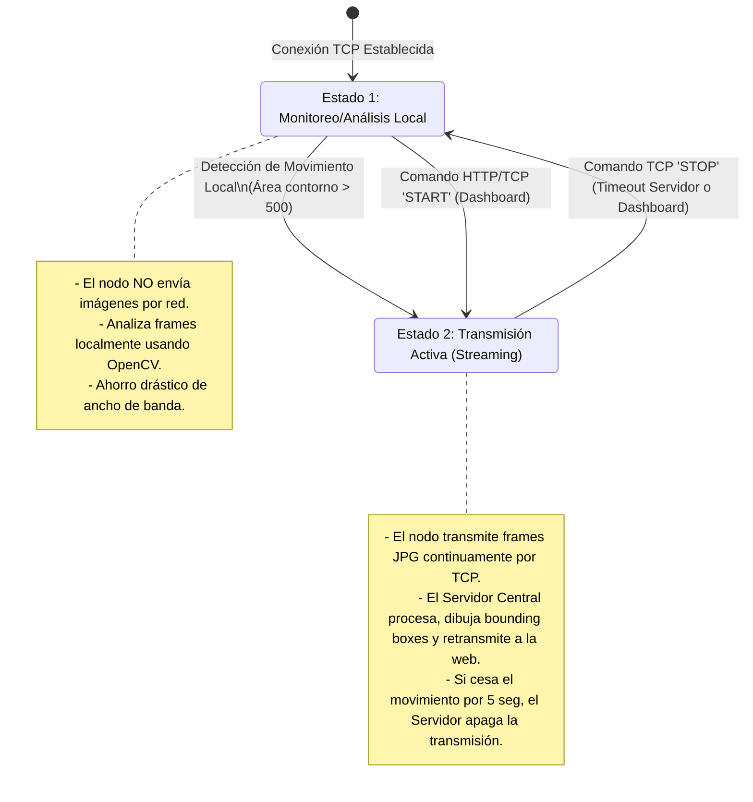

# 📹 Sistema de Visión Computacional Distribuido e Inteligente

Este proyecto implementa un sistema de videovigilancia distribuido inteligente diseñado para optimizar el ancho de banda y el consumo de recursos. Se compone de **Nodos de Borde (Edge Nodes)** (que pueden ejecutarse en Raspberry Pi o simularse en PCs), un **Servidor Central (Central Server)** y un **Cliente Web (Web Client Dashboard)** moderno en React.

---

## 🏛️ Arquitectura del Sistema

El flujo de información y control entre los tres componentes del sistema se detalla en el siguiente esquema:



### Componentes Principales

1. **Servidor Central (`centralServer`)**:
   - **Servidor TCP (Puerto `5555`)**: Recibe flujos de video crudos de los nodos y envía comandos bidireccionales (`START` / `STOP`) a través del mismo socket TCP.
   - **Servidor Web HTTP (Puerto `8081`)**: Proporciona endpoints REST para listar las cámaras y controlarlas, así como un stream de video en formato **MJPEG** (`multipart/x-mixed-replace`) a demanda para el dashboard.
   - **Procesador de Frames (`FrameProcessor`)**: Cuando una cámara transmite, procesa el video usando OpenCV (grises, desenfoque gaussiano, diferencia absoluta, umbral y detección de contornos). Dibuja cuadros verdes sobre el movimiento y superpone el texto *"MOVIMIENTO DETECTADO"*.
   - **Monitor de Inactividad (`InactivityMonitor`)**: Realiza un escaneo periódico de las cámaras transmitiendo. Si no se registra movimiento durante un tiempo determinado (5 segundos en la configuración actual), envía automáticamente un comando TCP `STOP` al nodo de borde.

2. **Nodos de Borde (`edgeNode`)**:
   - Capturan imágenes de una cámara física (índice 0 por defecto) a través de OpenCV (`VideoCapture`).
   - Se conectan mediante sockets TCP al Servidor Central.
   - Implementan un sistema de estados inteligente para alternar entre procesamiento local y transmisión activa.

3. **Cliente Web (`webClient`)**:
   - Dashboard premium de monitoreo construido en **React + Vite** con una estética oscura.
   - Realiza polling (cada 500ms) para actualizar la lista de cámaras, IPs y estados de transmisión.
   - Permite forzar manualmente el inicio o la detención de las transmisiones individuales.

---

## ⚙️ Máquina de Estados de los Edge Nodes

Para optimizar el uso de red y procesamiento del servidor, los Nodos de Borde implementan dos estados bien definidos:



---

## 💻 Simulación y Ejecución en Windows (2 o más Edges)

El trabajo práctico exige **al menos 2 Edge Nodes**. Ejecutarlos en una única PC bajo Windows presenta el desafío de que **el hardware de la cámara web (índice 0) no puede ser abierto por dos procesos al mismo tiempo**.

A continuación, se describen las mejores estrategias para resolver esto de manera sencilla.

### Estrategia A: Simulación mediante Archivos de Video (Recomendada)
Para simular múltiples cámaras en una sola computadora sin depender de webcams físicas, puedes hacer una pequeña modificación en `VideoSource.java` para que acepte tanto un índice de cámara como una ruta de archivo de video (como un `.mp4` o `.avi`).

#### 1. Modificación sugerida en [VideoSource.java](file:///c:/Users/Fabrizio/Documents/Facultad/Universidad-Informatica-UNLP/v5/edgeNode/src/main/java/org/alumnosinfo/tpdistribuido/VideoSource.java):
Reemplaza el constructor para admitir tanto enteros como strings (rutas a videos):
```java
// Permite inicializar con un índice (cámara física) o un string (ruta a un archivo de video)
public VideoSource(String source, int width, int height) {
    try {
        // Intentar parsear como número (índice de cámara)
        int deviceIndex = Integer.parseInt(source);
        camera = new VideoCapture(deviceIndex);
    } catch (NumberFormatException e) {
        // Si no es un número, cargarlo como ruta de archivo de video
        camera = new VideoCapture(source);
        // Habilitar loop en el video si es necesario en tu lógica
    }
    
    camera.set(Videoio.CAP_PROP_BUFFERSIZE, 1);
    if (source.matches("\\d+")) {
        camera.set(Videoio.CAP_PROP_FRAME_WIDTH, width);
        camera.set(Videoio.CAP_PROP_FRAME_HEIGHT, height);
    }

    if (!camera.isOpened()) {
        throw new RuntimeException("No se pudo abrir la fuente de video: " + source);
    }
}
```
Con esto, puedes pasar como argumento un archivo de video diferente a cada instancia para simular flujos de video independientes con movimiento real.

### Estrategia B: Uso de Cámaras Virtuales / Dispositivos Móviles
Puedes instalar herramientas para crear webcams virtuales en Windows:
1. **OBS Studio (Virtual Camera)**: Permite emitir una escena de OBS como si fuera una webcam física.
2. **ManyCam o SplitCam**: Permiten clonar la cámara web real en múltiples canales virtuales (que se registran como cámara `1`, `2`, etc.).
3. **DroidCam / Iriun**: Conectan tu smartphone como una webcam adicional vía Wi-Fi o USB (dispositivo `1`).

Para usar estas cámaras en los Edge Nodes, simplemente ejecuta cada instancia pasándole el índice correspondiente (ej. `0` para la integrada, `1` para DroidCam/OBS).

### Estrategia C: Uso del Entorno Virtual (Vagrant + VirtualBox)
El proyecto incluye un `Vagrantfile` para provisionar 3 máquinas virtuales Linux (Ubuntu 22.04 LTS) con Java 21 y Maven preinstalados:
- **`central_server`**: `192.168.56.10`
- **`edge_node_1`**: `192.168.56.20`
- **`edge_node_2`**: `192.168.56.21`

#### Pasos para ejecutar con Vagrant:
1. Abre una terminal de PowerShell en la raíz del proyecto y levanta las VMs:
   ```powershell
   vagrant up
   ```
2. Accede al servidor central para iniciarlo:
   ```powershell
   vagrant ssh central_server
   # Dentro de la VM:
   ./start_central.sh
   ```
3. En otras dos terminales, accede a cada Edge Node:
   ```powershell
   # Terminal 2 - Nodo 1
   vagrant ssh edge_node_1
   ./start_edge.sh
   
   # Terminal 3 - Nodo 2
   vagrant ssh edge_node_2
   ./start_edge.sh
   ```
> [!IMPORTANT]
> Para que las VMs de VirtualBox reconozcan la cámara web física o virtual, debes ir a la configuración de la VM en VirtualBox -> sección **USB** -> y agregar la cámara de la lista de filtros de USB. Recuerda que un dispositivo USB físico solo puede estar capturado por **una** máquina virtual a la vez.

---

## 🚀 Guía de Ejecución Rápida (Nativo en Windows)

Si prefieres ejecutar todo directamente en Windows (sin virtualización, que es mucho más rápido y evita conflictos de USB en VirtualBox):

### Requisitos previos:
- **Java JDK 21** o superior instalado y configurado en el `PATH`.
- **Maven** instalado y configurado en el `PATH`.
- **Node.js** (v18+) instalado para el dashboard web.

---

### Paso 1: Iniciar el Servidor Central
1. Abre una consola en `./centralServer` y compila:
   ```cmd
   mvn clean compile
   ```
2. Ejecuta el servidor:
   ```cmd
   mvn exec:java -Dexec.mainClass="org.alumnosinfo.tpdistribuido.CentralServer"
   ```
   *(Verás mensajes indicando que el servidor TCP se inició en el puerto 5555 y el Web en http://localhost:8081)*

---

### Paso 2: Iniciar los Edge Nodes (Nativo en Windows)
Dado que estamos en Windows y quieres usar tus dos cámaras físicas (o una física y una simulada), abre dos consolas independientes en `./edgeNode`:

1. **Edge Node 1 (Cámara 1, índice `0`, ID: `CAM_01`)**:
   Abre la **Terminal 1** en `./edgeNode` y ejecuta:
   ```cmd
   mvn exec:java -Dexec.mainClass="org.alumnosinfo.tpdistribuido.EdgeNode" -Dexec.args="localhost CAM_01 0"
   ```

2. **Edge Node 2 (Cámara 2, índice `1`, ID: `CAM_02`)**:
   Abre la **Terminal 2** en `./edgeNode` y ejecuta:
   ```cmd
   mvn exec:java -Dexec.mainClass="org.alumnosinfo.tpdistribuido.EdgeNode" -Dexec.args="localhost CAM_02 1"
   ```

*(Nota: Si quieres probar con un archivo de video en lugar de la segunda cámara, puedes pasar la ruta al video como tercer argumento: `-Dexec.args="localhost CAM_02 C:/videos/prueba.mp4"`).*

---

### Paso 3: Iniciar el Cliente Web (Dashboard)
1. Abre una consola en `./webClient`.
2. Instala las dependencias necesarias:
   ```cmd
   npm install
   ```
3. Lanza el servidor de desarrollo:
   ```cmd
   npm run dev
   ```
   *(Típicamente correrá en http://localhost:5173)*
